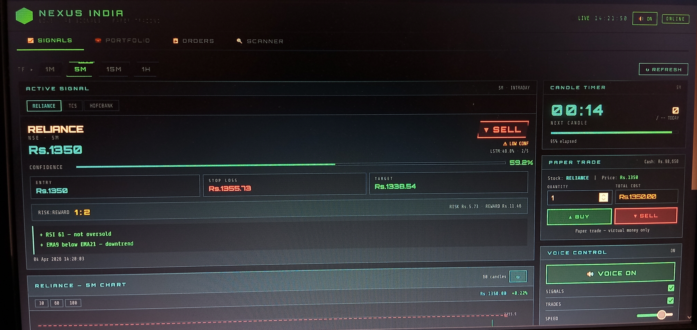
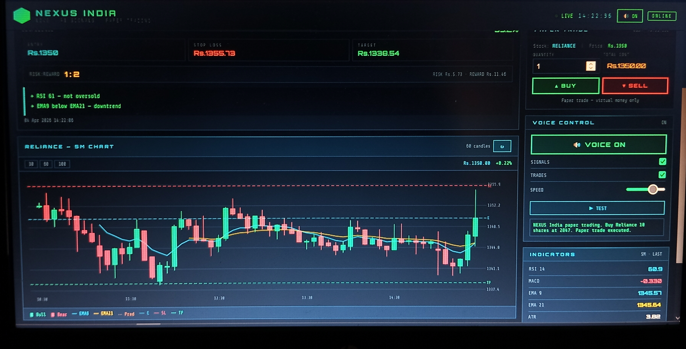
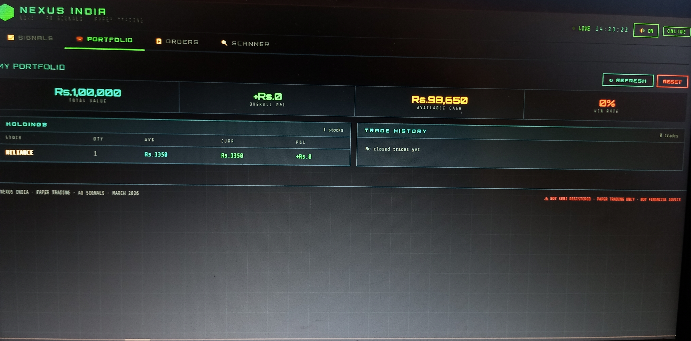
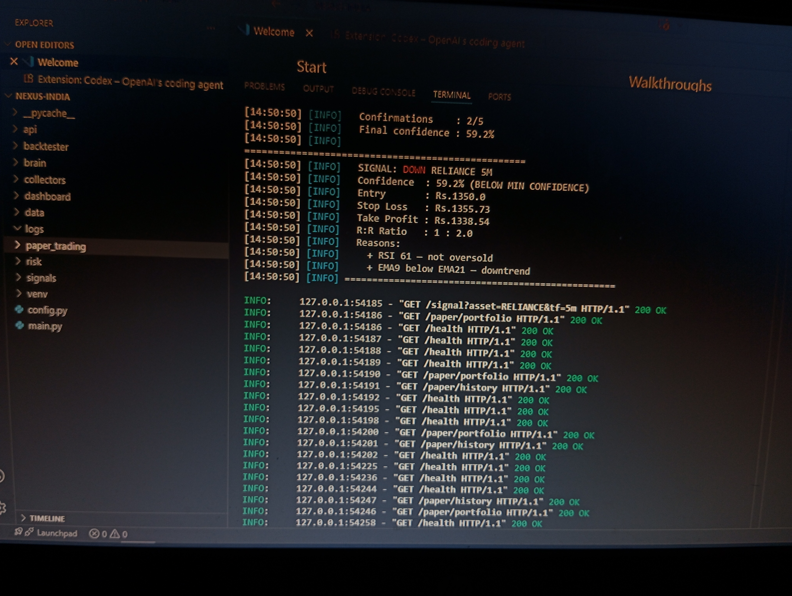
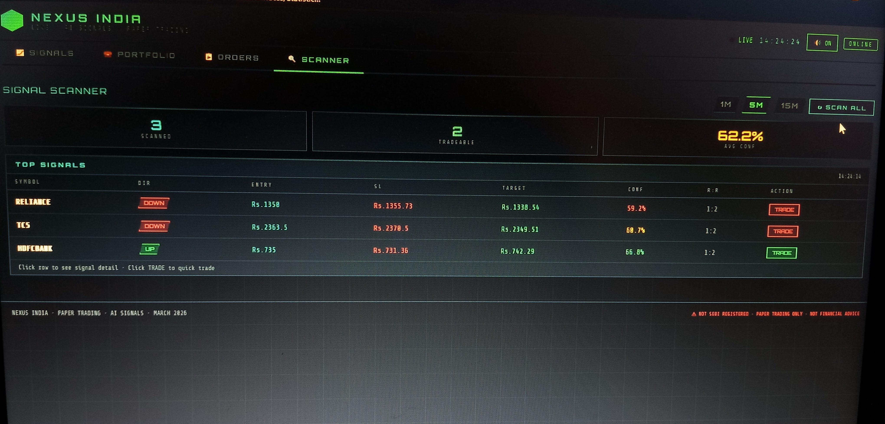
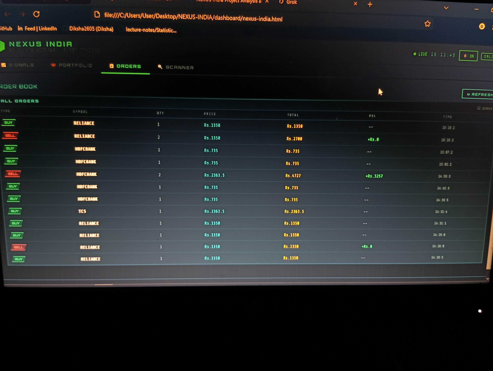

# 🟢 NXIO — AI-Powered Stock Market Trading Dashboard

> **Multi-Timeframe Market Intelligence | NSE · BSE · MCX | LSTM + Hybrid Signal Engine | Paper Trading**



---

## 🚀 What is NXIO?

NXIO is a personal AI-powered stock market analysis and paper trading dashboard built from scratch using Python and vanilla JavaScript. It combines **LSTM deep learning models** with **technical indicator confirmations** to generate buy/sell signals for NSE stocks across 4 timeframes.

> ⚠️ **Disclaimer:** This is a personal learning project. NOT SEBI registered. NOT financial advice. Paper trade only. Always consult a SEBI-registered advisor before investing real money.

---

## 📸 Screenshots

### 📈 Signals Screen — Live AI Signal with Candle Chart


### 📊 Live Candle Chart — EMA Lines + Entry/SL/TP Levels


### 💼 Portfolio Screen — Holdings + P&L Tracking


### 💼 Portfolio with Multiple Holdings


### 🔍 Scanner Screen — Top Signals Across All Stocks


### 📋 Orders Screen — Complete Trade History


---

## ✨ Features

### 🤖 AI Signal Engine
- **LSTM Deep Learning** — Trained on real NSE historical data
- **Hybrid Confirmation** — LSTM + RSI + MACD + EMA + VWAP + Volume Spike
- **Confidence Score** — Combined score with timeframe boost
- **Entry / Stop Loss / Target** — ATR-based dynamic levels
- **Risk:Reward Ratio** — Automatically calculated
- **Why Explanation** — Shows which indicators confirmed the signal

### 📊 Live Candle Chart
- Real OHLCV candle chart drawn on HTML Canvas
- EMA 9 (cyan) and EMA 21 (gold) overlay lines
- Entry, Stop Loss, Target price levels as dashed lines
- Prediction candles shown after last real candle
- 30 / 60 / 100 candle view options
- Last price + change % display

### 🔮 Multi-Candle Prediction
- Next 5 candles direction predicted (UP ▲ / DOWN ▼)
- Predicted price for each candle
- Confidence percentage per candle
- Overall trend: BULLISH / BEARISH / NEUTRAL
- Prediction candles drawn on chart

### 💼 Paper Trading System
- Virtual Rs.1,00,000 starting capital
- BUY / SELL with modal — set quantity, SL, Target
- Real-time P&L tracking
- Holdings table with unrealized P&L
- Complete trade history
- Win rate calculation
- Portfolio reset option

### 🔍 Signal Scanner
- Scans RELIANCE, TCS, HDFCBANK simultaneously
- Shows top BUY and SELL signals
- Confidence, Entry, SL, Target, R:R for each
- TRADE button for quick paper trading from scanner
- 1M / 5M / 15M timeframe filter

### 🔊 Voice Announcements
- Speaks signal details on refresh
- Trade execution announcements
- New candle alerts
- Indian English voice preferred
- Speed + Volume control
- Toggle ON/OFF per category

### ⏱️ Candle Timer
- Countdown to next candle close
- Progress bar showing elapsed time
- Candles done today counter
- Auto-refresh on new candle

---

## 🏗️ Project Structure

```
NXIO/
├── collectors/
│   ├── nse_stocks.py      # NSE stock data fetcher
│   ├── nifty.py           # NIFTY/SENSEX index data
│   └── mcx.py             # MCX Gold/Silver/Crude data
│
├── brain/
│   ├── features.py        # RSI, MACD, EMA, Bollinger feature engineering
│   ├── lstm_model.py      # LSTM model training (4 timeframes)
│   ├── predictor.py       # Multi-candle prediction engine
│   └── models/            # Saved .h5 model files
│
├── signals/
│   └── generator.py       # Hybrid signal engine (LSTM + Technical)
│
├── paper_trading/
│   └── portfolio.py       # Virtual trading engine
│
├── api/
│   └── server.py          # FastAPI backend
│
├── dashboard/
│   └── nxio.html   # Full frontend app
│
├── data/
│   ├── raw/               # Raw OHLCV CSVs (1M/5M/15M/1H)
│   ├── processed/         # Feature-engineered CSVs
│   ├── portfolio.json     # Virtual portfolio state
│   ├── orders.json        # Order history
│   └── trade_history.json # Closed trade history
│
├── config.py              # Central configuration
├── main.py                # Phase 1 data collection
└── requirements.txt       # Python dependencies
```

---

## 🛠️ Tech Stack

| Category | Technology |
|----------|-----------|
| Language | Python 3.11 |
| Backend | FastAPI + Uvicorn |
| AI Model | TensorFlow / Keras LSTM |
| Indicators | `ta` library |
| Data Source | yfinance (NSE historical) |
| Frontend | HTML + CSS + JavaScript |
| Charts | HTML5 Canvas API |
| Voice | Web Speech API |
| Database | JSON files |

---

## 📦 Installation

### 1. Clone the repo
```bash
git clone https://github.com/yourusername/NXIO.git
cd NXIO
```

### 2. Create virtual environment
```powershell
python -m venv venv
venv\Scripts\Activate.ps1
```

### 3. Install dependencies
```bash
pip install yfinance pandas numpy ta colorama tqdm tensorflow fastapi uvicorn
```

### 4. Collect data (Phase 1)
```bash
python main.py
```

### 5. Engineer features (Phase 2)
```bash
python brain/features.py
```

### 6. Train LSTM models (Phase 3)
```bash
python brain/lstm_model.py
```

### 7. Start API server
```bash
uvicorn api.server:app --reload --port 8000
```

### 8. Open dashboard
```bash
start dashboard/nxio.html
```

---

## 📡 API Endpoints

| Endpoint | Method | Description |
|----------|--------|-------------|
| `/health` | GET | API status check |
| `/signal?asset=RELIANCE&tf=5m` | GET | AI signal for stock |
| `/candles?asset=RELIANCE&tf=5m&n=60` | GET | OHLCV + indicators |
| `/predict?asset=RELIANCE&tf=5m&candles=5` | GET | Next 5 candle prediction |
| `/scan?tf=5m` | GET | Scan all stocks |
| `/paper/buy` | POST | Place paper buy order |
| `/paper/sell` | POST | Place paper sell order |
| `/paper/portfolio` | GET | Portfolio summary |
| `/paper/orders` | GET | All orders |
| `/paper/history` | GET | Trade history |
| `/paper/reset` | POST | Reset to Rs.1,00,000 |

Full interactive docs: `http://localhost:8000/docs`

---

## 📊 Supported Assets

### NSE Stocks
- RELIANCE Industries
- TCS (Tata Consultancy Services)
- HDFCBANK

### NSE Indices
- NIFTY 50
- BANK NIFTY
- SENSEX

### MCX Commodities
- Gold (COMEX proxy)
- Silver (COMEX proxy)
- Crude Oil (NYMEX proxy)

---

## ⏱️ Timeframes

| TF | Candle | Best For | Conf Boost | Signal Accuracy |
|----|--------|----------|-----------|----------------|
| 1M | 1 min | Expert scalping | 0% | ~60-62% |
| **5M** | **5 min** | **Intraday (DEFAULT)** | **+3%** | **~64-68%** |
| 15M | 15 min | Swing trades | +5% | ~68-72% |
| 1H | 60 min | Positional | +7% | ~72-76% |

---

## 🧠 How The Signal Engine Works

```
Step 1: Load LSTM model for symbol + timeframe
Step 2: Prepare last 30 candles with features
Step 3: LSTM predicts UP/DOWN probability
Step 4: Check 5 technical confirmations:
        ✓ RSI zone (not overbought/oversold)
        ✓ MACD crossover direction
        ✓ EMA 9 vs EMA 21 cross
        ✓ Price vs VWAP
        ✓ Volume spike
Step 5: Final confidence = LSTM % + confirmations × 2.5% + TF boost
Step 6: Calculate Entry, SL (ATR × 1.5), Target (ATR × 3.0)
Step 7: Return signal if confidence ≥ 60%
```

---

## 🗺️ Development Roadmap

- [x] Phase 1 — Data collection (NSE/MCX/Indices, 4 timeframes)
- [x] Phase 2 — Feature engineering (RSI, MACD, EMA, BB, ATR, VWAP)
- [x] Phase 3 — LSTM model training (9 models)
- [x] Phase 4 — Hybrid signal engine
- [x] Phase 5 — Multi-candle prediction
- [x] Phase 6 — FastAPI backend
- [x] Phase 7 — Live dashboard + candle chart
- [x] Phase 8 — Paper trading system
- [ ] Phase 9 — Angel One SmartAPI (real-time, pending bank account)
- [ ] Phase 10 — Real order placement
- [ ] Phase 11 — Mobile app (PWA)

---

## ⚠️ Important Notes

- **Data delay:** yfinance provides 15-minute delayed data. Real-time requires Angel One SmartAPI.
- **LSTM accuracy:** ~52% raw accuracy, improved to ~65-68% with hybrid confirmation system.
- **Paper trade only:** Do NOT use for real money trading until Angel One integration is complete.
- **Personal use:** This project is for learning and research only.

---

## 📄 License

This project is for **personal educational use only**.

Not SEBI registered. Not financial advice. Use at your own risk.

---

## 🙏 Built With

- Python 3.11
- TensorFlow / Keras
- FastAPI
- yfinance
- ta (Technical Analysis library)
- HTML5 Canvas
- Web Speech API

---

*Built with ❤️ as a learning project — NXIO, April 2026*
